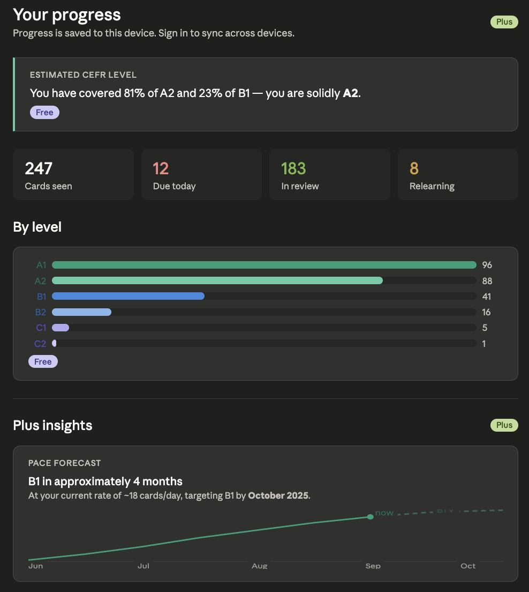
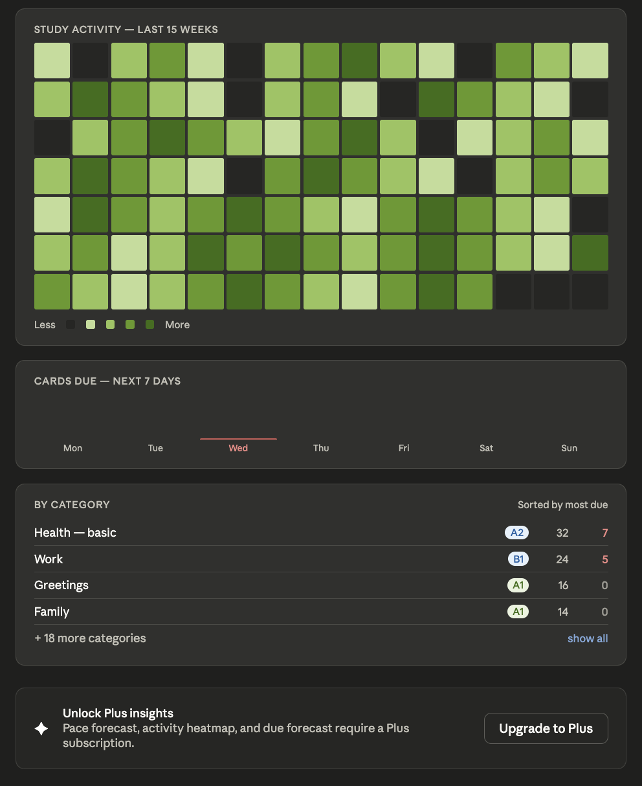

Let me render a mockup of what the Plus stats page could look like, building on what already exists.Here's the proposed layout. A few things to note about the structure:

[See a mockup](plus_stats_page_mockup.html)

**Free section (top)** — the CEFR estimate, summary metrics, and by-level bars stay exactly as they are today. No regression for free users.

**Plus section** — four new additions, each pulling from Supabase data (which is why they're gated):

- **Pace forecast** — a simple projected line chart to the user's target CEFR level. Requires knowing cards/day rate over time, which only exists in Supabase review history. The dashed section is the projection.
- **Activity heatmap** — 15 weeks of daily study activity, GitHub-style. Motivating without being a streak mechanic. Again needs historical review logs.
- **Due forecast** — a 7-day bar chart of upcoming due cards. Helps users plan. Wednesday is highlighted in red as a heavy day.
- **Per-category breakdown** — the existing table, but gated to Plus. Free users don't see which specific categories need work.

**Upsell banner** — shown to free users at the bottom of the Plus section, replacing the locked charts with a single clean prompt to upgrade. No blurred previews or fake locked content — just a clear explanation of what they'd get.

The key design choice: free users still get a genuinely useful page (CEFR estimate + level bars). The Plus section adds depth without making the free experience feel broken.

Want to adjust anything — different charts, different gate placement, or the upsell copy?
