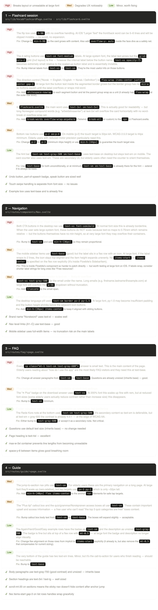

Let me read all the relevant files systematically.The flashcard page is `[level]/[category]/+page.svelte`. Let me read the main flashcard files:Now let me find the actual VocabFlashcardPage component:Now I have a thorough picture of everything. Let me put together the full audit:Now I have a thorough read of all four areas. Let me produce the audit:

That's the full audit across all four areas. Here's the summary of priorities before you start:

**Fix first (high impact, few lines each):**

- Flashcard card: `h-96` → `min-h-96`
- Flashcard rating interval labels: `text-xs` → `text-sm`
- FAQ answers: `text-sm` → `text-base` (10 instances, mechanical change)
- Nav CTA buttons: `text-xs` → `text-sm` + `min-h`

**Fix second:**

- Guide callout boxes: `text-sm` → `text-base`
- Nav email in dropdown: add `truncate`
- Flashcard mode segmented control: add `whitespace-nowrap`
- Guide anchor pills: add `min-h-[40px]`

**Quick wins with biggest UX payoff for elderly users:** the FAQ `text-sm` → `text-base` change is the single biggest improvement for the least effort — it's a find-and-replace across one file.

Want to start with the flashcard or the FAQ?

The flashcard page has updated.
